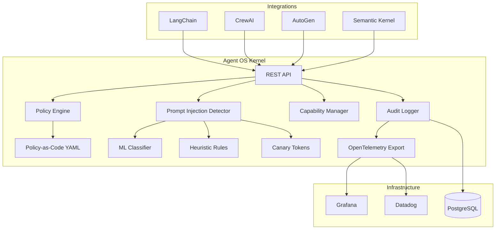

# CNCF Sandbox Proposal: Agent OS

## Name

**Agent OS** — A governance kernel for AI agents in cloud-native environments.

## Description

Agent OS is an open-source governance kernel that provides policy enforcement, prompt injection detection, capability-based security, and audit logging for AI agents running in production. It is the core component of the Agent Governance stack, which adds zero-trust communication (AgentMesh), runtime isolation (Agent Hypervisor), and reliability engineering (Agent SRE). Agent OS is designed to be embedded in cloud-native applications or deployed as a standalone API server, with native OpenTelemetry integration and Kubernetes-friendly deployment patterns.

## Statement on Alignment with CNCF Mission

Agent OS aligns with the CNCF mission of making cloud-native computing ubiquitous by providing the **governance layer for AI agents in cloud-native environments**.

Just as the CNCF ecosystem provides governance for containers and infrastructure:
- **OPA/Gatekeeper** governs Kubernetes admission policies
- **Falco** provides runtime security for containers
- **Trivy** scans container images for vulnerabilities

No CNCF project addresses the governance needs of AI agents — a rapidly growing category of cloud-native workloads. Agent OS fills this gap:
- **OPA governs what containers can do; Agent OS governs what AI agents can do**
- **Falco detects anomalous container behavior; Agent OS detects anomalous agent behavior**
- **Trivy scans containers for vulnerabilities; Agent OS detects prompt injection attacks**

AI agents are the next wave of cloud-native workloads, and they need purpose-built governance tooling that integrates with the CNCF ecosystem (OpenTelemetry, Kubernetes, Helm).

## Sponsor from TOC

TBD — Seeking a TOC sponsor. The project aligns with the Runtime and Observability TAGs.

## Unique Value

### What does Agent OS add to the CNCF landscape?

1. **First governance layer for AI agents in the CNCF ecosystem.** No existing CNCF project addresses AI agent safety, trust, or reliability. OPA, Falco, and Trivy are excellent for containers and infrastructure but do not understand agent-specific concerns like prompt injection, tool misuse, or autonomous decision-making.

2. **Native OpenTelemetry integration.** Agent OS exports governance telemetry (policy decisions, injection detection events, audit records) as OpenTelemetry traces and metrics, integrating seamlessly with the CNCF observability ecosystem.

3. **SRE discipline for AI agents.** Agent SRE brings SLOs, error budgets, and chaos engineering to AI agents — concepts proven in cloud-native operations but not yet applied to agentic AI workloads.

4. **Cloud-native deployment model.** Agent OS is stateless, horizontally scalable, and designed for Kubernetes deployment with Helm charts, HPA, and network policies.

### CNCF Landscape Positioning

```
                     Containers/Infra          AI Agents
                    ┌──────────────────┐   ┌──────────────────┐
    Policy          │  OPA / Gatekeeper│   │  Agent OS         │
                    ├──────────────────┤   ├──────────────────┤
    Runtime Safety  │  Falco           │   │  Agent Hypervisor │
                    ├──────────────────┤   ├──────────────────┤
    Scanning        │  Trivy           │   │  Prompt Injection │
                    │                  │   │  Detector         │
                    ├──────────────────┤   ├──────────────────┤
    Observability   │  OpenTelemetry   │   │  Agent SRE        │
                    │                  │   │  (OTEL-native)    │
                    ├──────────────────┤   ├──────────────────┤
    Identity        │  SPIFFE/SPIRE    │   │  AgentMesh (DID)  │
                    └──────────────────┘   └──────────────────┘
```

## Current Status

- **License:** MIT
- **Language:** Python 3.9+
- **Installation:** `pip install ai-agent-governance[full]`
- **Test suite:** 3,000+ tests across the stack (Agent OS: 2,000+, AgentMesh: 500+, Agent SRE: 329+, Agent Hypervisor: 200+)
- **Framework integrations:** 12+ (LangChain, CrewAI, AutoGen, Semantic Kernel, LlamaIndex, Haystack, OpenAI Agents SDK, Google ADK, MCP, A2A, and more)
- **Observability integrations:** 11 platforms (Datadog, Grafana, New Relic, Splunk, Azure Monitor, AWS CloudWatch, etc.)
- **PyPI packages:** `ai-agent-governance`, `agent-os-kernel`, `agentmesh-platform`, `agent-hypervisor`, `agent-sre`

## Roadmap Alignment with CNCF

| Milestone | Timeline | CNCF Alignment |
|-----------|----------|----------------|
| Kubernetes Operator for Agent OS | Q3 2025 | Native K8s integration |
| Helm chart in Artifact Hub | Q3 2025 | CNCF distribution |
| OpenTelemetry Collector receiver | Q4 2025 | OTEL ecosystem |
| SPIFFE/SPIRE integration | Q4 2025 | CNCF identity |
| CRD-based policy management | Q1 2026 | Kubernetes-native policy |
| Multi-cluster federation | Q2 2026 | Cloud-native scale |

## Project Health

- **Release cadence:** Regular releases on PyPI
- **Documentation:** Architecture guides, API reference, enterprise deployment guides, OWASP mapping
- **Security:** SECURITY.md with responsible disclosure process
- **Community:** GitHub Issues and Discussions open for contributions
- **Contributor diversity:** Seeking to grow the contributor base through CNCF Sandbox inclusion

## Architecture Overview



**Design principles:**
- **Stateless kernel:** No session state in the governance API; scale horizontally without coordination
- **Policy-as-code:** Governance policies defined in YAML, version-controlled alongside application code
- **Framework-agnostic:** Works with any AI agent framework via REST API or Python SDK
- **Defense-in-depth:** Multiple detection strategies (heuristic, ML, canary) for prompt injection

## Similar Projects and Differentiation

| Project | Scope | Difference from Agent OS |
|---------|-------|--------------------------|
| **OPA/Gatekeeper** | Infrastructure admission policies | OPA governs Kubernetes resources; Agent OS governs AI agent behavior (prompt injection, tool permissions, output filtering) |
| **Falco** | Container runtime security | Falco detects syscall anomalies in containers; Agent OS detects behavioral anomalies in AI agents (prompt injection, privilege escalation, data leakage) |
| **Trivy** | Container/artifact vulnerability scanning | Trivy scans static artifacts; Agent OS provides runtime governance for dynamic AI agent behavior |
| **SPIFFE/SPIRE** | Workload identity | SPIFFE provides infrastructure identity; AgentMesh provides agent-level identity with trust scoring for multi-agent systems |
| **LLM Guard** | LLM input/output scanning | LLM Guard is a scanning library; Agent OS is a complete governance kernel with policy enforcement, capability control, and audit logging |

**Key differentiator:** Agent OS is the only project that provides a **complete governance stack** (policy + trust + runtime + SRE) for AI agents, designed for cloud-native deployment with native CNCF ecosystem integration.

---

## Appendix: CNCF Sandbox Criteria Checklist

- [x] Open source under an OSI-approved license (MIT)
- [x] Hosted on a neutral foundation-friendly platform (GitHub)
- [x] Adopted or used in production (or clearly on path)
- [x] Aligned with CNCF mission (cloud-native governance for AI agents)
- [x] Clear differentiation from existing CNCF projects
- [x] Healthy contributor and maintenance practices
- [ ] TOC sponsor identified (seeking sponsor)

---

*Submitted by the [Agent Governance](https://github.com/imran-siddique/agent-governance) project*
