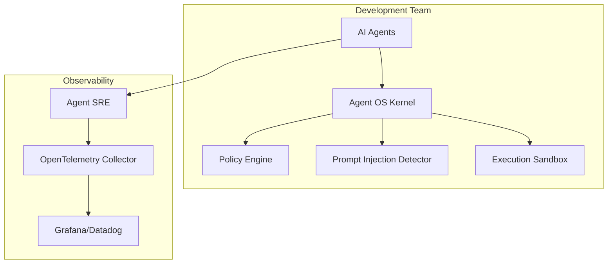
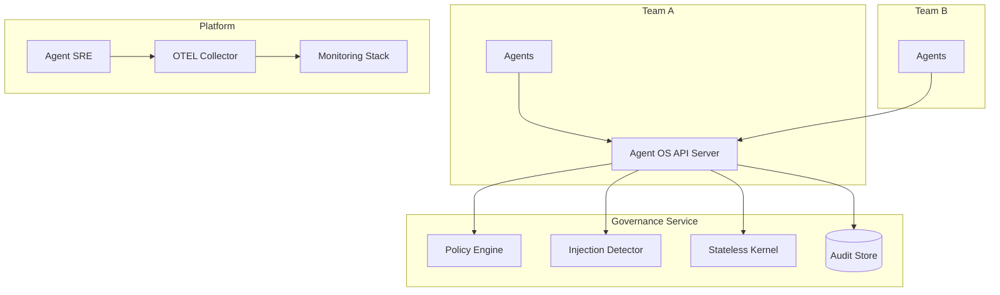
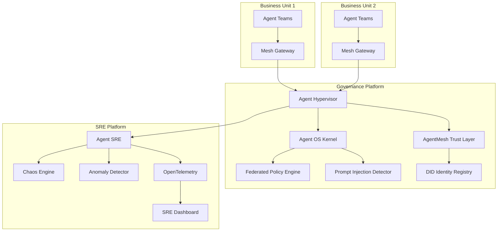

# Reference Architecture

This document describes three deployment patterns for the Agent Governance stack, progressing from a single team to a full enterprise deployment.

Choose the pattern that matches your current scale — you can migrate to a larger pattern as your agent fleet grows.

---

## 1. Single-Team Deployment

**When to use:** One team running 1–20 AI agents. Getting started with governance. No shared governance infrastructure needed.

**Components needed:** Agent OS Kernel, Agent SRE (optional)

**Estimated scale:** Up to 500 requests/sec, single node



### How It Works

In this pattern, the governance kernel is embedded directly into the application. Each agent call passes through the kernel's policy engine and prompt injection detector before execution. Agent SRE runs alongside the application, exporting telemetry to your existing observability stack.

**Deployment model:** Library embedded in application process (no separate service)

**Key configuration:**

```python
from agent_os import StatelessKernel, ExecutionContext

kernel = StatelessKernel()
ctx = ExecutionContext(
    agent_id="my-agent",
    capabilities=["read", "write"],
    policies=["no-pii-leakage", "tool-allowlist"]
)

# Every agent action is governed
result = kernel.execute(ctx, action="call_tool", tool="search", args={"q": "revenue"})
```

---

## 2. Multi-Team Deployment

**When to use:** Multiple teams sharing governance policies. Centralized audit and compliance requirements. 20–200 agents.

**Components needed:** Agent OS (API server mode), Agent SRE, Audit Store (Postgres)

**Estimated scale:** Up to 10,000 requests/sec, 3–5 replicas



### How It Works

The governance kernel runs as a centralized API server that multiple teams call via REST. Policies are managed centrally but can be scoped per team or per agent. All audit logs flow to a shared store for compliance reporting.

**Deployment model:** Centralized governance microservice + per-team agent workloads

**Key benefits over single-team:**
- Centralized policy management — update policies once, enforce everywhere
- Unified audit trail across all teams
- Shared prompt injection detection models
- Platform team manages governance infra; product teams consume via API

**API usage:**

```bash
# Agents call the governance API before executing actions
curl -X POST https://governance.internal/api/v1/evaluate \
  -H "Authorization: Bearer $AGENT_TOKEN" \
  -d '{
    "agent_id": "team-a-agent-1",
    "action": "call_tool",
    "tool": "database_query",
    "context": {"prompt": "Show me all user emails"}
  }'
```

---

## 3. Enterprise Deployment

**When to use:** Multiple business units. Federated governance with local policy overrides. Hundreds to thousands of agents. Regulatory requirements (SOC2, HIPAA, GDPR).

**Components needed:** Full stack — Agent OS, AgentMesh, Agent Hypervisor, Agent SRE, DID Registry, Federated Policy Store

**Estimated scale:** 50,000+ requests/sec, 10+ replicas, multi-region capable



### How It Works

The full enterprise deployment adds trust mesh, runtime isolation, and federated policies on top of the multi-team pattern. Each business unit connects through a mesh gateway that authenticates agents using decentralized identifiers (DIDs). The Agent Hypervisor provides runtime isolation, resource limits, and kill switches. Agent SRE adds chaos engineering and anomaly detection for fleet-wide reliability.

**Deployment model:** Platform-as-a-service with mesh gateways per business unit

**Key capabilities:**
- **Federated policies:** Global policies set by security team, local overrides per business unit
- **DID-based identity:** Cryptographic agent identity that works across organizational boundaries
- **Runtime isolation:** Hypervisor enforces execution rings and resource limits per agent
- **Chaos engineering:** Continuous adversarial testing of governance controls
- **Anomaly detection:** ML-based behavioral analysis across the entire agent fleet

**Federation example:**

```yaml
# Global policy (enforced everywhere)
global:
  policies:
    - no-pii-in-logs
    - prompt-injection-detection
    - max-token-budget: 100000

# Business unit override
business_units:
  healthcare:
    policies:
      - hipaa-compliance
      - phi-detection
      - max-token-budget: 50000  # Stricter limit
  engineering:
    policies:
      - code-execution-sandbox
      - dependency-allowlist
```

---

## Choosing Your Pattern

| Factor | Single-Team | Multi-Team | Enterprise |
|--------|-------------|------------|------------|
| **Agents** | 1–20 | 20–200 | 200+ |
| **Teams** | 1 | 2–10 | 10+ |
| **Deployment** | Embedded library | Centralized API | Federated platform |
| **Policy mgmt** | Local config | Central API | Federated with overrides |
| **Identity** | Agent ID strings | API keys / JWT | DID-based cryptographic |
| **Audit** | Local logs | Central database | Immutable distributed store |
| **Compliance** | Basic | SOC2-ready | SOC2, HIPAA, GDPR |
| **Infrastructure** | Single node | 3–5 node cluster | Multi-region K8s |

### Migration Path

Most teams start with the single-team pattern and migrate as needs grow:

1. **Single → Multi-Team:** Extract the embedded kernel into a standalone API server. Add a shared audit store. Migrate policy files to the central API.
2. **Multi-Team → Enterprise:** Add AgentMesh gateways. Deploy Agent Hypervisor for runtime isolation. Set up DID registry. Configure federated policies.

Each migration is incremental — no big-bang cutover required.

---

*Next: [Kubernetes Deployment Guide](kubernetes-deployment.md)*
